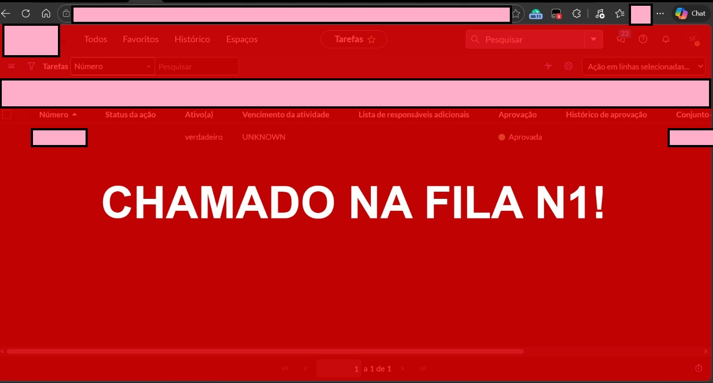

# ServiceNow Queue Automator 🚀

An automated client-side monitoring and alert tool written in vanilla JavaScript, deployed as a browser Userscript via Tampermonkey. It dynamically parses ServiceNow DOM environments to eliminate repetitive monitoring tasks and accelerate incident triage.

## 🎯 The Operational Problem
In enterprise support ecosystems, analysts constantly execute manual browser refreshes to detect high-priority incidents. This manual overhead creates operational latency and visual fatigue.

## 💡 The Solution 
This script programmatically executes lightweight background scans across the rendered DOM and Shadow DOM components. It immediately creates high-visibility structural overlays and sound alerts when a target incident appears.

## ✨ Key Technical Competencies
- **Shadow DOM Traversal:** Iterates through encapsulated web components.
- **Asynchronous State Evaluation:** Stateful polling loops.
- **Dynamic DOM Manipulation:** Programmatically injects UI elements.

## 🛠️ Technologies
- JavaScript (ES6+)
- Tampermonkey
- DOM Manipulation